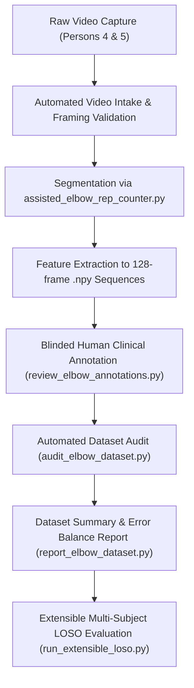

# Assisted Elbow Flexion: Data Collection & Annotation Protocol
**Target Cohort**: Persons 4 and 5 (Multi-Subject Generalization Expansion)  
**System Status**: Pipeline and Evaluators FROZEN (Phase 9)  
**Production Biomechanical Evaluator**: 85.24% Balanced Accuracy | **Research Benchmark (Nested LOSO Duration)**: 85.87% Balanced Accuracy

---

## 1. Purpose & Guiding Principles

The objective of Phase 9 data collection is to evaluate **genuine cross-subject generalization** by introducing new, unobserved participants (Persons 4 and 5). 

### Non-Negotiable Engineering Rules
1. **Zero Retraining During Collection**:
   - The current production biomechanical rule evaluator and research ML models are **completely frozen**.
   - No feature pruning, threshold re-optimization, or model fine-tuning may be performed until new subjects are fully collected, audited, and evaluated.
2. **Natural Execution Over Artificial Mimicry**:
   - Errors must emerge from **natural biomechanical variation**, fatigue, muscle weakness, or habitual compensation.
   - Subjects must **NOT** be coached to artificially manufacture caricatured motions.
3. **Clinical / Expert Ground Truth Supremacy**:
   - **Never** use deterministic biomechanical rules or learned ML predictions as ground truth.
   - Ground truth labels must be independently determined by human annotators adhering to clinical movement definitions.
4. **Strict Subject-Level Isolation**:
   - Every subject is treated as an isolated domain. All subsequent evaluation must execute Leave-One-Subject-Out (LOSO) validation where zero data, normalization statistics, or thresholds from the held-out subject leak into training or tuning.

---

## 2. Capture Environment & Hardware Setup

| Parameter | Specification | Purpose / Rationale |
| :--- | :--- | :--- |
| **Camera View** | Frontal Plane (0° azimuth, parallel to subject) | Captures bilateral elbow flare, torso rotation, and elbow flexion depth simultaneously. |
| **Camera Height** | Mid-torso height (~1.0 m – 1.2 m from floor) | Minimizes vertical perspective distortion and parallax angle skew. |
| **Camera Distance** | 2.5 m – 3.0 m from subject | Ensures full body framing (vertex of head to mid-thigh/knees). |
| **Resolution & FPS**| 1080p (1920x1080), 30 fps (or 60 fps constant) | 30 fps matches existing feature extraction and sequence generation pipelines. |
| **Lighting** | Diffuse frontal/ambient light, no harsh backlighting | Prevents MediaPipe landmark jitter and wrist/elbow tracking dropouts. |
| **Apparel** | Contrast-colored, form-fitting shirts (short sleeves preferred) | Eliminates landmark occlusion caused by baggy cloth shifting over joint centers. |
| **Seating / Stance**| Standard upright chair without armrests, feet flat | Standardizes spinal tilt and eliminates leg compensation while exposing trunk rotation. |

---

## 3. Movement Modes & Exercise Execution

Each subject must perform both single-hand and bilateral assistance variations across separate recorded trials.

### Mode 1: Single-Hand Assisted Elbow Flexion
- **Active Arm**: Designated arm performing flexion (Left or Right).
- **Assisting Arm**: Contralateral hand supports the active forearm or wrist to guide and assist the motion.
- **Starting Position**: Active arm extended downwards (elbow angle $\ge 120^\circ$, neutral flare).
- **Concentric Phase**: Active elbow flexes smoothly until maximal comfortable or target flexion is achieved.
- **Eccentric Phase**: Controlled extension back to the starting position without dropping.

### Mode 2: Both-Hand Assisted Elbow Flexion (Bilateral Support)
- **Execution**: Both hands clasp together (or one hand firmly clasps the contralateral wrist/forearm in a symmetric plane) to lift and lower together.
- **Kinematic Significance**: Naturally elevates baseline elbow flare due to bilateral elbow positioning. Tests whether the evaluator avoids false rejections on natural anatomical carrying angles.

---

## 4. Targeted Error Diversity (Categories A through J)

Prior analysis on Persons 1–3 established that existing models suffer when encountering unrepresented compensation strategies. Data collection for Persons 4 and 5 must actively monitor for the following natural error profiles:

| Code | Target Movement Profile | Biomechanical Manifestation | Clinical Significance |
| :---: | :--- | :--- | :--- |
| **A** | **Correct High-ROM Repetitions** | Deep flexion ($\text{min angle} < 80^\circ$), wide excursion ($\text{ROM} > 50^\circ$), controlled pace, neutral flare ($\le 0.30$). | Confirms the system does not penalize exceptional mobility or deep functional flexion. |
| **B** | **Correct with Naturally Elevated Flare** | Good flexion depth ($\le 100^\circ$), smooth cadence, but anatomical carrying angle or wide torso produces flare near the $0.26 - 0.32$ boundary. | Critical test case for preventing false alarms on broader body habitus or bilateral grips. |
| **C** | **Incorrect Shallow Flexion** | Incomplete concentric phase; elbow halts at $105^\circ - 125^\circ$ ($\text{min angle} > 101^\circ$). | Primary target of flexion depth rule; tests sensitivity to fatigue-induced truncation. |
| **D** | **Incorrect Excessive Elbow Flare** | Active or assisting elbow flares laterally outward ($> 0.30 \times W_{\text{ref}}$) during concentric lifting. | Abduction compensation indicates biceps/brachialis weakness or deltoid substitution. |
| **E** | **Incorrect Transverse Torso Rotation** | Subject twists torso or retracts active shoulder ($|\text{rotation}| > 20^\circ$) to heave forearm upward. | Trunk substitution disguises limited elbow flexion strength. |
| **F** | **Incorrect Rapid Eccentric Dropping** | Concentric phase is slow, but eccentric lowering collapses ballistically ($\text{ext\_dur} < 0.70\text{s}$, total $\text{duration} < 1.75\text{s}$). | Essential safety deficit; uncontrolled lowering risks joint micro-trauma in hemophilia. |
| **G** | **Incorrect Poor Control / Tremor** | Erratic velocity oscillations, severe micro-stuttering, or visible tremor throughout trajectory. | Indicates neuromuscular fatigue, lack of eccentric motor control, or pain inhibition. |
| **H** | **Incorrect Anterior Shoulder Roll** | Clavicular hiking, scapular anterior tilting, or shoulder shrug during terminal flexion. | Compensatory strategy to artificially decrease perceived elbow angle. |
| **I** | **Incorrect Stalling / Trajectory Control** | Subject freezes mid-repetition for $>0.8\text{s}$, exhibits multi-peak velocity profiles, or hesitates due to weakness. | Reflects lack of continuous motor control and abnormal kinematic rhythm. |
| **J** | **Rule-Passing False-Correct Candidates** | Geometric metrics pass ($\text{min\_angle} \le 101^\circ, \text{flare} \le 0.30, \text{ROM} \ge 25^\circ, |\text{rot}| \le 20^\circ$), but movement is clinically invalid (e.g. violent wrist flicking, assistance arm doing 100% of passive dragging, or torso surging forward). | Pure movement-quality edge cases that test the boundary between geometry and true motor control. |

---

## 5. Standardized Repetition Annotation Structure

All collected data must be reviewed at the individual repetition level and recorded with the exact authoritative schema:

### Authoritative CSV Schema (`clean_elbow_train_expanded.csv`)
```text
subject_id           : 'person4' | 'person5'
video_name           : Raw MP4 filename (e.g., person4_both_assisted_correct_01.mp4)
repetition_index     : Integer (1-indexed repetition count within video)
assistance_type      : 'left_hand_assisted' | 'right_hand_assisted' | 'both_hand_assisted'
folder_label         : Coarse session folder label ('correct' | 'wrong' | 'mix')
ground_truth_label   : Strictly 'Correct' | 'Incorrect' | 'Ambiguous' (Human Clinician Assessed)
error_tags           : Semicolon- or comma-separated tags (see vocabulary below)
annotator            : Identifier of the human reviewer (e.g., 'clinician_review', 'devesh')
timestamp            : ISO-8601 recording timestamp (YYYY-MM-DDTHH:MM:SS)
notes                : Free-text diagnostic justification for edge cases
start_frame          : First frame of segmented repetition
end_frame            : Last frame of segmented repetition
duration_sec         : Total repetition duration in seconds
rom                  : Measured angular range of motion (degrees)
min_elbow_angle      : Minimum active elbow angle reached (degrees)
max_elbow_angle      : Starting/maximum active elbow angle (degrees)
elbow_flare          : Maximum active elbow flare normalized by reference shoulder width
torso_tilt           : Maximum sagittal torso tilt angle (degrees)
torso_rotation       : Transverse torso rotation angle (degrees)
smoothness           : Dimensionless spectral arc length or normalized smoothness metric
sequence_file        : Associated 128-frame 8-channel .npy sequence file
```

### Standardized Vocabulary for `error_tags`
- `insufficient_flexion` (shallow flexion, min angle > 101°)
- `excessive_elbow_flare` (flare > 0.30)
- `torso_rotation` (shoulder twisting > 20°)
- `rapid_eccentric_drop` (ballistic lowering, ext_dur < 0.70s)
- `poor_control_tremor` (jerky, oscillating trajectory)
- `shoulder_compensation` (scapular hiking / anterior roll)
- `trajectory_stalling` (prolonged pause or freeze mid-motion)
- `insufficient_rom` (ROM < 25°)
- `occlusion_tracking_defect` (MediaPipe landmark failure; mark as `Ambiguous`)

---

## 6. Subject-Level Isolation & Ingestion Workflow

To guarantee zero test-set leakage, follow this step-by-step ingestion lifecycle:



### Quality Assurance Gates Before Supervised Inclusion
1. **No Missing Annotations**: Every repetition must have a non-null `ground_truth_label` (`Correct` or `Incorrect`).
2. **Ambiguous Sample Isolation**: Any repetition with tracking drops, severe limb occlusion, or incomplete recording must be tagged `Ambiguous` and omitted from evaluation splits.
3. **Audit Verification**: The candidate dataset must pass `python src/data/audit_elbow_dataset.py` with zero errors (no duplicates, no repeated frames, no NaN/Inf features, no subject leakage).
