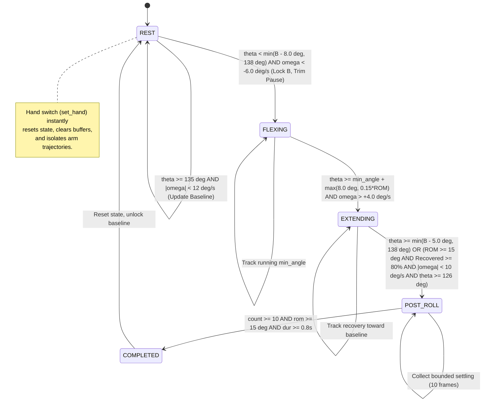

# Causal Cycle-Based Repetition Segmenter: Technical Design Specification
## Assisted Elbow Flexion V2 — Phase 7 Research

---

### 1. Architectural Philosophy & Overview

In Phase 6, evaluation of real-world continuous webcam streams identified critical limitations in fixed-threshold state machines (Strategy 2):
1. **Pause Bleeding:** Blindly prepending fixed circular buffers (e.g. 20 frames) during multi-second motionless rests dilated repetition windows, severely degrading temporal IoU (dropping median IoU on held-out continuous sessions to **0.462**).
2. **Threshold Rigidity:** A single hard-coded angle threshold (135°) failed to accommodate patient baseline variation and pathological restricted range of motion (ROM), leading to 16 missed repetitions and 12 fragmented repetitions.
3. **Adaptive Drift:** Naive running baseline estimators (Strategy 5) drifted downward during exercise pauses, resulting in massive boundary errors.

The **Causal Cycle Segmenter** (`CausalCycleSegmenter`) abandons static threshold crossings in favor of **trajectory-aware cycle detection**. It models elbow flexion as a physical thermodynamic cycle operating strictly forward in time (causal, zero lookahead):

$$\text{Quiescent Extension Baseline } (B_{\text{ext}}) \longrightarrow \text{Flexion Arc} \longrightarrow \text{Turnaround } (\theta_{\min}) \longrightarrow \text{Extension Recovery} \longrightarrow \text{Settling}$$

---

### 2. State Machine Architecture

---

### 3. Mathematical & Algorithmic Formulation

#### 3.1 Causal Instantaneous Kinematics
For frame $k$ at hardware timestamp $t_k$ and world landmarks $\mathbf{P}_k \in \mathbb{R}^{33 \times 4}$:
- Active elbow 3D joint angle $\theta_k$ is computed from shoulder, elbow, and wrist coordinates via 3D vector geometry:
  $$\cos \theta_k = \frac{(\mathbf{p}_{\text{shoulder}} - \mathbf{p}_{\text{elbow}}) \cdot (\mathbf{p}_{\text{wrist}} - \mathbf{p}_{\text{elbow}})}{\|\mathbf{p}_{\text{shoulder}} - \mathbf{p}_{\text{elbow}}\| \|\mathbf{p}_{\text{wrist}} - \mathbf{p}_{\text{elbow}}\|}$$
- Instantaneous velocity is estimated causally:
  $$v_k = \frac{\theta_k - \theta_{k-1}}{\max(t_k - t_{k-1}, 10^{-4})}$$
- A 3-frame causal median filter smooths optical tracking jitter:
  $$\omega_k = \text{median}(v_{k-2}, v_{k-1}, v_k)$$

#### 3.2 Drift-Resistant Adaptive Extension Baseline
To accommodate individual variations in natural resting extension (canonical median 148°, range 136°–168°) without suffering drift during long resting intervals:
- **Quiescent Gating:** The running baseline buffer $\mathcal{H}_B$ (capacity 30 frames) updates **only** when the user is in `REST` at high extension with minimal velocity:
  $$\theta_k \ge 135.0^\circ \quad \text{and} \quad |\omega_k| \le 12.0^\circ/\text{s}$$
- **Clamped Baseline:**
  $$B_k = \text{clip}\left(\text{median}(\mathcal{H}_B), 136.0^\circ, 168.0^\circ\right)$$
- **Baseline Locking:** Upon transition to `FLEXING`, $B_{\text{locked}} = B_k$. The baseline is completely frozen throughout the active repetition and settling phases, preventing any downward drift.

#### 3.3 Trajectory-Aware Flexion Onset & Pause Pruning
Transition from `REST` to `FLEXING` requires simultaneous excursion and velocity confirmation:
$$\theta_k < \min(B_{\text{locked}} - \Delta_{\text{onset}}, 138.0^\circ) \quad \text{and} \quad \omega_k < -6.0^\circ/\text{s} \quad (\Delta_{\text{onset}} = 8.0^\circ)$$
- **Pause Pruning:** Rather than prepending the entire 20-frame pre-roll buffer, the segmenter scans backward in the pre-roll buffer to identify the exact frame $m$ where movement departed from steady state:
  $$m = \max \left\{ j \in [k - K_{\text{pre}}, k] \;\big|\; |\omega_j| < 3.0^\circ/\text{s} \text{ and } \theta_j \ge B_{\text{locked}} - 3.0^\circ \right\}$$
  Frames prior to $m$ (static motionless rest) are discarded, eliminating pause bleeding.

#### 3.4 Causal Turnaround Detection
During `FLEXING`, the segmenter maintains $\theta_{\min} = \min_{j \in \text{buffer}} \theta_j$ and current excursion $\text{ROM}_{\text{current}} = \max_{j} \theta_j - \theta_{\min}$.
Transition to `EXTENDING` triggers when:
$$\theta_k \ge \theta_{\min} + \max(\Delta_{\text{reversal}}, 0.15 \times \text{ROM}_{\text{current}}) \quad \text{and} \quad \omega_k > +4.0^\circ/\text{s} \quad (\Delta_{\text{reversal}} = 8.0^\circ)$$
This two-stage confirmation ensures that minor hesitations or tracking noise do not cause premature turnaround triggers while smoothly latching true extension recovery.

#### 3.5 Extension Recovery & Contracture Tolerance
In `EXTENDING`, the segmenter identifies completion when the forearm returns to resting extension:
1. **Near Baseline:** $\theta_k \ge \min(B_{\text{locked}} - 5.0^\circ, 138.0^\circ)$, OR
2. **Contracture Settling:** Accommodating arthropathic joints unable to achieve $135^\circ$:
   $$\theta_k \ge \theta_{\min} + 0.80 \times \text{ROM}_{\text{current}} \quad \text{and} \quad |\omega_k| < 10.0^\circ/\text{s} \quad \text{and} \quad \theta_k \ge 126.0^\circ$$
Upon meeting either condition, the segmenter enters `POST_ROLL` for $K_{\text{post}} = 10$ frames (~333 ms) to allow complete settling before validating invariants and emitting the completed window.

#### 3.6 Hand-Switch Decoupling
When active hand metadata toggles (`set_hand(new_hand)`):
- The segmenter executes an immediate clean reset: state is restored to `REST`, active buffers are cleared, and baseline history is reinitialized to default (148.0°).
- This strictly guarantees that the extension settling of one arm cannot merge with the flexion onset of the opposing arm.

---

### 4. Parameter Specification Table

| Parameter | Value | Unit | Physical Rationale |
| :--- | :---: | :---: | :--- |
| `min_rom` | 15.0 | degrees | Accommodates restricted therapeutic repetitions (down to 17.1°) while rejecting postural tremor (< 12°). |
| `onset_delta` | 8.0 | degrees | Requires 8° departure from natural resting baseline to prevent false triggering from postural sway. |
| `reversal_delta` | 8.0 | degrees | Demands 8° (or 15% ROM) inflection from minimum to confirm genuine turnaround. |
| `pre_roll` | 15 | frames | Bounded buffer capacity (500 ms) for capturing natural extension onset. |
| `post_roll` | 10 | frames | Bounded settling window (333 ms) to capture full recovery without bleeding into subsequent reps. |
| `min_frames` | 15 | frames | Enforces minimum kinematic duration (500 ms at 30 fps). |
| `min_duration_sec` | 0.8 | seconds | Filters out optical glitches and rapid accidental arm twitches. |
